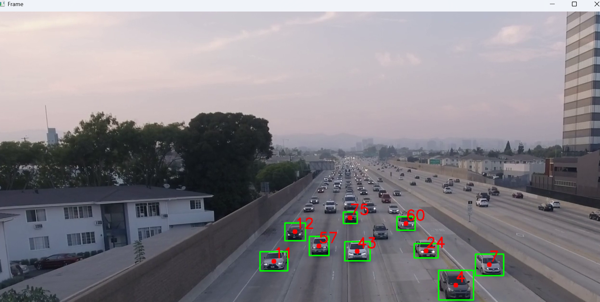

# 🚀 Smart Object Detection & Tracking System (YOLOv4 + OpenCV)

---

## 📌 Project Overview

This project is a real-time **Object Detection and Tracking System** built using:

- 🧠 YOLOv4 (Deep Learning Model)
- 🎥 OpenCV (Computer Vision Library)
- 📊 Custom Centroid Tracking Algorithm

It detects multiple objects in a video and assigns **unique IDs** to each object, tracking them across frames in real time.

---

## 📂 Project Structure

Smart-Object-Detection-Tracking/
│
├── assets/
│   ├── detect 1.png
│   ├── detect 2.png
│
├── dnn_model/
│   ├── yolov4.weights
│   ├── yolov4.cfg
│   ├── coco.names
│
├── object_detection.py
├── tracking.py
├── requirements.txt
└── README.md

---

## 🧠 How It Works

- YOLOv4 model detects objects in each video frame
- OpenCV processes frames in real-time
- Detected objects are converted into centroids
- A distance-based tracking algorithm assigns unique IDs
- Objects are tracked across frames even when moving

---

## 🔍 Key Features

- 🎯 Real-time object detection
- 🆔 Unique ID tracking for each object
- 📦 Bounding box visualization
- 🎥 Video file processing support
- ⚡ Lightweight CPU-based execution (no GPU required)
- 🧠 YOLOv4 deep learning model integration

---

## 🔧 Key Functional Modules

### ➤ Object Detection
- Uses YOLOv4 pretrained on COCO dataset
- Detects multiple objects per frame
- Outputs bounding boxes + confidence scores

### ➤ Object Tracking
- Assigns unique IDs to detected objects
- Tracks movement using centroid distance matching
- Removes lost objects automatically

### ➤ Video Processing
- Reads input video file (`rush.mp4`)
- Processes frame-by-frame detection and tracking

---

## 📸 Sample Output

### 🧠 Detection View


### 📦 Tracking View


---

## ⚙️ Installation Guide

### 1️⃣ Clone Repository
```bash
git clone https://github.com/hamzamehmoodkhan1245/AI-Tracking-System.git
cd AI-Tracking-System

2️⃣ Install Dependencies
pip install -r requirements.txt

## 3️⃣ Download YOLOv4 Files

To run this project correctly, you must download the pretrained YOLOv4 model files and place them inside the `dnn_model/` directory.

### 📁 Required Files:

- `yolov4.weights` → Pretrained YOLOv4 model weights  
- `yolov4.cfg` → YOLOv4 network configuration file  
- `classes.txt` → List of object class names (COCO dataset labels)

### 📌 Folder Structure After Setup:

dnn_model/
├── yolov4.weights
├── yolov4.cfg
└── classes.txt

## 🚀 Future Improvements

- 🔐 Add login authentication system  
- 📊 Export detection logs to CSV/Excel  
- 📸 Enable real-time webcam support  
- 🌐 Convert into a full web application (Flask / Django / React)  
- 🤖 Integrate AI-based analytics dashboard  
- 📱 Develop mobile application version  

---

## 💡 Project Highlights

- ✔ Deep Learning + Computer Vision combined  
- ✔ Real-time object tracking system  
- ✔ Lightweight CPU-based execution  
- ✔ Scalable and modular architecture  
- ✔ Industry-level foundation project  

---

## 👨‍💻 Author

**Hamza Haroon**

📧 Email: hamzamehmoodkhan1245@gmail.com  
🔗 GitHub: https://github.com/hamzamehmoodkhan1245  

---

## ⭐ Support

If you like this project:

- ⭐ Star this repository  
- 🍴 Fork it  
- 🚀 Share it  
- 🧠 Contribute improvements  
